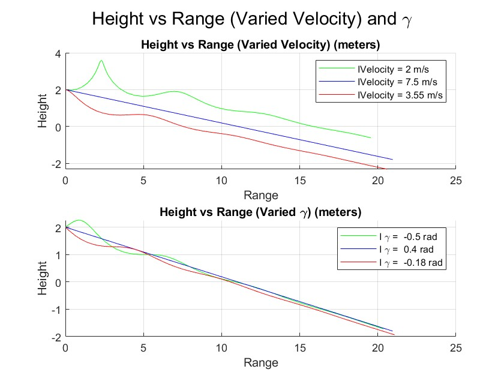
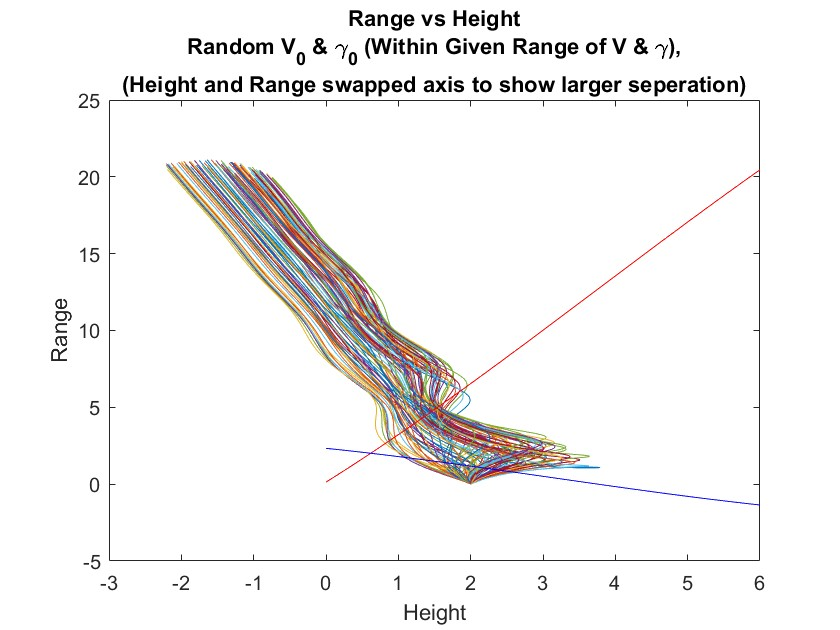
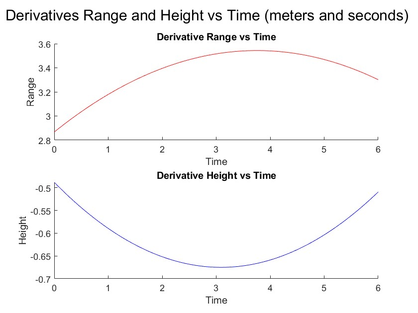

## Paper Airplane Numerical Study
Final Project AEM 3103 Spring 2024
By: Jonathan Kalbacken

## Summary of Findings
Variations studied:

                             Lower   Nominal   Higher
    gamma (radians):         -0.5;     -0.18;     0.4  
    V (meters/second):          2;      3.55;     7.5 

In this study the main goal was to determine the impact of the intial velocity and flight path angle on the trajectory of an aircraft.
(In this case a paper airplane).
By examining Figure 1 it can be seen that changing the intial path angle doesn't result in a large difference of trajectory when compared to changing the intial velocity. Continuing to examine Figure 1 it can be seen that the nominal velocity and flight path angle trjectory places the plane at static stability as the flight path can be seen as a linear line. Changing the intial path angle in reality did not disturb the glide range much at all especially when compared to changing the intial velocity as when the intial velocity was changed the fglide range changed drastically. To determine the glide range we need to focus on the x-intercept of the figure or where the height = 0 on the y-axis and then use the value of the x-coordinate assigned with that range.

# Code Listing
-EqMotion.m
https://github.com/JonnyKalbacken/Final/blob/main/EqMotion.m

In this function the timespan, intial velocity, intial gamma, dynamic pressure, and the verical/horizontal equations are taken into account. 

-Final_Project.m
https://github.com/JonnyKalbacken/Final/blob/main/FinalCode.m    

In this script all of the graphing and analysis is run through MATLAB and creates the figures used in this project.

## Fig. 1: Single Parameter Variation

In figure one the nominal trajectory is shown in blue while also showing the varying parameter flight paths which are seen in red and green in both graphs. In both figures the decreased is shown in red while the increased is shown in red. Both trajectories pass through height = 0, due to the code causing the plot to pass through time = 6. This is due to the fact that the code doe not know that the ground is not a reality therefore on the graph causing the trajectory to in simple terms pass through the ground. Basically if the plane started higher, then the trajectory on the graph would not go through the ground and this would be correct, however since we are unable to show the coding software that the ground exists I am unable to account for this oversight.

## Fig. 2: Monte Carlo Simulation

In Figure two the Monte Carlo simulation was attempted by simulating 100 random flight trajectories using random path angles and random velocities which were all within the range of the lowest and highest values shown in Figure one. These can be seen in the random assortment of colors. That being said I swapped the x and y axis to show more seperation within the simulations however this doesn't change any of the data rather the graph just seems off because to the swapped axes.

Figure two also has the polyfit of the two equations. In blue is the average height (respect to time) values while in red is the average range (respect to time). This graph has many aspects that may be confusing but that is more or less due to the fact that the two polyfit lines are in retrospect there own seperate graphs placed on the main one with the simulations. This is because there is no time axis which causes the polyfit lines to seem skewed or incorrect because they arent moving the correct direction becuase there is no respect to time axis. That being said to make up for this it can be stated that time is the y-axis and height/range respectively are the x-axis for these polyfit lines.

## Fig.3: Time Derivatives 

The above figure contains the plots of the time derivatives of the
two polynomial equations used for figure 2.

Figure three is the plots of the time derivatives of the equations used for Figure two. The range derivative plot is shown in red and shows the rate at which the distance increases along the x-axis, while the blue plot shows the rate at which the height changes along the y-axis. The curvature of the graph is based on simple calculus. If you take the derivative of a 3rd degree polynomial the computed derivative is a 2nd degree polynomial. Since the paths were all randomized this curvature makes perfect sense as both the height and range would have varying rates of change throughout its flight path along with different random values corresponding at each time interval.
